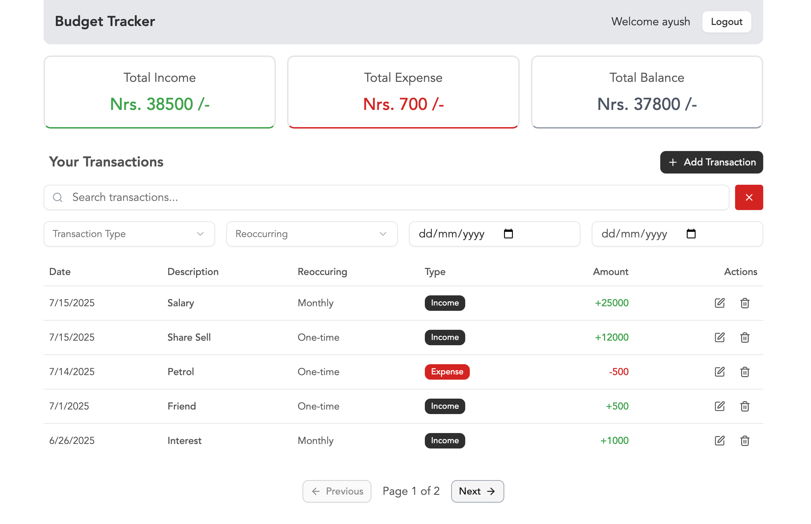

<!-- # React + TypeScript + Vite

This template provides a minimal setup to get React working in Vite with HMR and some ESLint rules.

Currently, two official plugins are available:

- [@vitejs/plugin-react](https://github.com/vitejs/vite-plugin-react/blob/main/packages/plugin-react) uses [Babel](https://babeljs.io/) for Fast Refresh
- [@vitejs/plugin-react-swc](https://github.com/vitejs/vite-plugin-react/blob/main/packages/plugin-react-swc) uses [SWC](https://swc.rs/) for Fast Refresh

## Expanding the ESLint configuration

If you are developing a production application, we recommend updating the configuration to enable type-aware lint rules:

```js
export default tseslint.config([
  globalIgnores(['dist']),
  {
    files: ['**/*.{ts,tsx}'],
    extends: [
      // Other configs...

      // Remove tseslint.configs.recommended and replace with this
      ...tseslint.configs.recommendedTypeChecked,
      // Alternatively, use this for stricter rules
      ...tseslint.configs.strictTypeChecked,
      // Optionally, add this for stylistic rules
      ...tseslint.configs.stylisticTypeChecked,

      // Other configs...
    ],
    languageOptions: {
      parserOptions: {
        project: ['./tsconfig.node.json', './tsconfig.app.json'],
        tsconfigRootDir: import.meta.dirname,
      },
      // other options...
    },
  },
])
```

You can also install [eslint-plugin-react-x](https://github.com/Rel1cx/eslint-react/tree/main/packages/plugins/eslint-plugin-react-x) and [eslint-plugin-react-dom](https://github.com/Rel1cx/eslint-react/tree/main/packages/plugins/eslint-plugin-react-dom) for React-specific lint rules:

```js
// eslint.config.js
import reactX from 'eslint-plugin-react-x'
import reactDom from 'eslint-plugin-react-dom'

export default tseslint.config([
  globalIgnores(['dist']),
  {
    files: ['**/*.{ts,tsx}'],
    extends: [
      // Other configs...
      // Enable lint rules for React
      reactX.configs['recommended-typescript'],
      // Enable lint rules for React DOM
      reactDom.configs.recommended,
    ],
    languageOptions: {
      parserOptions: {
        project: ['./tsconfig.node.json', './tsconfig.app.json'],
        tsconfigRootDir: import.meta.dirname,
      },
      // other options...
    },
  },
])
``` -->

# Budget Tracker App

A simple, full-featured budget tracking app built with React and TypeScript. Track your income and expenses, apply dynamic filters, and get real-time summaries. Built with modern UI and best practices.

## Run Locally

Clone the project

```bash
  git clone https://github.com/AyushKazi/budget-tracker.git
```

Go to the project directory

```bash
  cd budget-tracker
```

Install dependencies

```bash
  npm install
```

Start the server

```bash
  npm run dev
```

## Features

- ✅ User Authentication (Login/Register)
- ✅ Add / Edit / Delete Transactions
- ✅ Filter by:
  - Type (Income / Expense)
  - Reoccurrence (Daily / Weekly / Monthly / One-time)
  - Date Range
  - Search by Description
- ✅ Summary Cards: Income, Expense, Total Balance
- ✅ Pagination for long lists
- ✅ Responsive & Accessible UI
- ✅ Error Boundaries and Not Found Pages

All the user data and transactions datas are stored in local storage of the web browser.

## Tech Stack

- [React](https://reactjs.org/)
- [TypeScript](https://www.typescriptlang.org/)
- [Tailwind CSS](https://tailwindcss.com/)
- [shadcn/ui](https://ui.shadcn.com/) for components
- [React Router](https://reactrouter.com/) for routing
- Context API for state management
- [Lucide Icons](https://lucide.dev/) for icons
- [Sonner](https://sonner.emilkowal.dev/) for toast notifications

## Reminder

You need Node 20.19.0 or later to run this Vite version properly.

## Screenshots




## License

This project is open source and available under the [MIT License](LICENSE).
